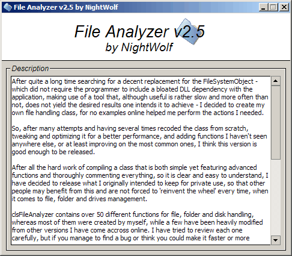



## clsFileAnalyzer v2\.5

### Description

After quite a long time searching for a decent replacement for the FileSystemObject - which did not require the programmer to include a bloated DLL dependency with the application, making use of a tool that, although useful is rather slow and more often than not, does not yield the desired results one intends it to achieve - I decided to create my own file handling class, for no examples online helped me perform the actions I needed.

So, after many attempts and having several times recoded the class from scratch, tweaking and optimizing it for a better performance, and adding functions I haven't seen anywhere else, or at least improving on the most common ones, I think this version is good enough to be released.

After all the hard work of compiling a class that is both simple yet featuring advanced functions and thoroughly commenting everything, so it is clear and easy to understand, I have decided to release what I originally intended to keep for private use, so that other people may benefit from this and are not forced to 'reinvent the wheel' every time, when it comes to file, folder and drives management.

clsFileAnalyzer contains over 50 different functions for file, folder and disk handling, whereas most of them were created by myself, while a few have been heavily modified from other versions I have come accross online. I have tried to review each one carefully, but if you manage to find a bug or think you could make it faster or more reliable, please do not hesitate to contact me.

You will find all my software on www.kaotix-crew.net, where many of my other open source applications have been released, so check back if you're interested.

I hope you enjoy this class,

- NightWolf
 
### More Info
 

             |
---                |---
**Submitted On**   |2007-02-10 03:56:42
**By**             |[\-=NightWolf=\-](https://github.com/Planet-Source-Code/PSCIndex/blob/master/ByAuthor/nightwolf.md)
**Level**          |Intermediate
**User Rating**    |5.0 (80 globes from 16 users)
**Compatibility**  |VB 6\.0
**Category**       |[Files/ File Controls/ Input/ Output](https://github.com/Planet-Source-Code/PSCIndex/blob/master/ByCategory/files-file-controls-input-output__1-3.md)
**World**          |[Visual Basic](https://github.com/Planet-Source-Code/PSCIndex/blob/master/ByWorld/visual-basic.md)
**Archive File**   |[clsFileAna2047292102007\.zip](https://github.com/Planet-Source-Code/nightwolf-clsfileanalyzer-v2-5__1-67832/archive/master.zip)

### API Declarations

Quite a few

